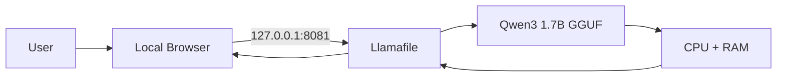
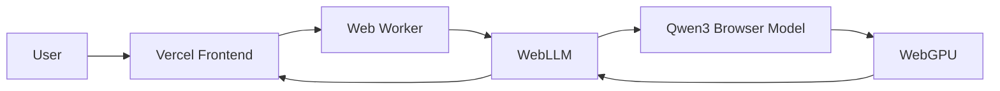

<p align="center">
  
</p>

<p align="center">
  
  
  
  <a href="https://github.com/Rishikeshsanin/Rishi-AI-BOT1/actions"></a>
</p>

<p align="center">
  <strong>Qwen3 1.7B · GGUF · Llamafile · Local Browser UI · CPU Mode</strong><br />
  <em>When the internet disappears, your AI does not have to.</em>
</p>

---

# 📴 Rishi AI BOT1

## Your AI for the moments when the internet is not there.

**Rishi AI BOT1 is an offline-first AI assistant for Windows.**

The main purpose of this project is not to compete with cloud chatbots. It is to give you a usable AI assistant when cloud chatbots are unavailable because you have **no signal, no Wi-Fi, poor connectivity, an outage, or simply want to keep inference on your own machine**.

Once the model and runtime files are already on your laptop, the core version runs locally with:

- no active internet connection
- no cloud inference API
- no API key
- no per-message token billing
- no dependency on a remote AI server

> **Core product:** dependable offline Windows AI.  
> **Side experiment:** browser/WebGPU deployment on Vercel.

---

## ✨ The use case in one line

> **No signal? Open Rishi AI BOT1 locally and keep using AI anyway.**

### Where this actually helps

| Situation | Why Rishi AI BOT1 helps |
|---|---|
| ✈️ Flight / travel | AI remains available without dependable connectivity |
| 🚆 Train / bus / remote area | Weak or missing mobile signal does not stop local inference |
| 🛜 Wi-Fi outage | The local assistant keeps running |
| 🎓 College / lab work | Experiment without depending on a hosted AI API |
| 🔒 Sensitive notes | Prompts stay on the machine in local mode |
| 💸 Avoid API usage costs | Local inference does not consume paid cloud tokens |
| 🧳 Portable setup | Keep the runtime + model together on a compatible Windows machine |

---

## ⭐ Which version should I use?

| Mode | Status | Internet needed? | Runs on | Recommendation |
|---|---|---:|---|---|
| **Windows Offline Mode** | ✅ **Core / Recommended** | **No, after setup** | CPU + RAM | **Use this** |
| **Browser WebGPU Mode** | 🧪 Experimental | Yes for site/model download | Browser GPU | Demo only |

The browser version is intentionally treated as an experiment. It can be slow, hardware-sensitive, or fail to initialize on some systems.

The **offline Windows version is the actual project focus**.

---

# 🖥️ Core Mode — Fully Offline Windows AI

```text
You
 │
 ▼
Local Browser UI
 │
 │ http://127.0.0.1:8081
 ▼
Llamafile
 │
 ▼
Qwen3 1.7B Q4_K_M GGUF
 │
 ▼
CPU + System RAM
```

### What stays local

- your prompts
- generated responses
- model inference
- the HTTP server
- the chat UI connection

The browser is only the interface. The model itself is running on your own computer.

---

# ⚡ Offline Quick Start

### 1. Clone the repository

```bash
git clone https://github.com/Rishikeshsanin/Rishi-AI-BOT1.git
cd Rishi-AI-BOT1
```

### 2. Add the local runtime files

Place these beside `start.bat`:

```text
llamafile-0.10.5.exe
qwen3-1.7b-q4_k_m.gguf
```

They are intentionally excluded from GitHub because they are large third-party runtime/model files.

Your folder should look like:

```text
Rishi-AI-BOT1/
├── start.bat
├── llamafile-0.10.5.exe
├── qwen3-1.7b-q4_k_m.gguf
└── ...repository files
```

### 3. Launch

Double-click:

```text
start.bat
```

Wait until the terminal reports:

```text
listening on http://127.0.0.1:8081
```

Then open:

```text
http://127.0.0.1:8081
```

### 4. Go offline

Once the runtime and model are already present, you can disconnect from the internet and continue chatting locally.

---

# 🔌 Why it works without internet

A typical cloud AI flow:

```text
Your device → Internet → Cloud AI server → Internet → Response
```

Rishi AI BOT1 offline flow:

```text
Your device → Local model → Response
```

The model weights live on the laptop, so generation happens there too.

The launcher uses:

```text
--server
--model qwen3-1.7b-q4_k_m.gguf
--gpu disable
--host 127.0.0.1
--port 8081
```

### Why CPU mode?

Automatic CUDA initialization crashed on the original development machine. The launcher therefore defaults to:

```text
--gpu disable
```

This gives a more predictable compatibility path without requiring a working CUDA setup.

### Why port 8081?

Port `8080` was already occupied by another Windows service during development, so the project uses `8081` instead.

---

# 🌐 Experimental Browser Demo

A deployed browser experiment is available here:

### **https://rishi-ai-bot1.vercel.app**

<p>
  <a href="https://rishi-ai-bot1.vercel.app"></a>
</p>

This version uses **WebLLM + WebGPU** to try running Qwen3 inside the visitor's browser.

It includes:

- WebGPU capability checks
- Qwen3 browser inference
- lighter-model fallback
- streaming responses
- thinking-mode toggle
- browser-local chat history
- Web Worker execution

### Current limitation

The web version is **not as reliable or fast as the offline version**. Performance depends heavily on browser, GPU, drivers, VRAM, and currently available system resources.

> If you want the real Rishi AI BOT1 experience, use the offline Windows mode.

---

# 🏗️ Architecture

## Offline mode — recommended



## Browser experiment



For a deeper explanation, see [`docs/ARCHITECTURE.md`](docs/ARCHITECTURE.md).

For the philosophy and real-world scenarios behind the project, see [`docs/OFFLINE-FIRST.md`](docs/OFFLINE-FIRST.md).

---

# 📁 Repository Structure

```text
Rishi-AI-BOT1/
├── .github/
│   └── workflows/
│       └── ci.yml
├── assets/
│   └── rishi-ai-banner.svg
├── docs/
│   ├── ARCHITECTURE.md
│   └── OFFLINE-FIRST.md
├── src/
│   ├── main.js
│   ├── style.css
│   └── worker.js
├── CHANGELOG.md
├── CONTRIBUTING.md
├── index.html
├── LICENSE
├── package.json
├── README.md
├── SECURITY.md
└── start.bat
```

Local-only files:

```text
llamafile-0.10.5.exe
qwen3-1.7b-q4_k_m.gguf
```

These remain ignored by Git.

---

# 🧪 Tech Stack

| Technology | Role |
|---|---|
| **Qwen3 1.7B** | Local language model |
| **GGUF Q4_K_M** | Quantized offline model format |
| **Llamafile** | Local inference runtime + HTTP server |
| **Windows Batch** | One-click offline launcher |
| **WebLLM** | Experimental browser-side runtime |
| **WebGPU** | Experimental browser acceleration |
| **Web Worker** | Keeps browser inference off the UI thread |
| **Vite** | Web frontend tooling |
| **Vercel** | Hosts the experimental browser frontend |
| **GitHub Actions** | Build validation |

---

# 🩺 Troubleshooting

### Offline mode shows `CUDA error`

Confirm the launcher contains:

```text
--gpu disable
```

### Local server cannot bind the port

```cmd
netstat -ano | findstr :8081
```

Close the conflicting process or change the configured port.

### Local browser says `Server unavailable`

Wait for:

```text
listening on http://127.0.0.1:8081
```

then refresh.

### Web demo is slow

That is currently expected on some systems. Browser inference runs on the visitor's GPU and is experimental. Use the offline Windows version for the main experience.

### Web model fails to load

Try a current Chromium-based browser with hardware acceleration enabled. WebGPU availability alone does not guarantee enough resources to initialize every model profile.

---

# 🔐 Privacy Model

## Offline mode

The local server binds to:

```text
127.0.0.1
```

which is the loopback interface. The intended configuration keeps inference and prompts on the same computer.

## Browser demo

The frontend and model artifacts require internet access to download, but inference is designed to happen inside the browser rather than through a Rishi AI BOT1 cloud inference backend.

Do not expose the local Llamafile server publicly without authentication and appropriate network security controls.

---

# ✅ Project Status

- [x] Qwen3 1.7B GGUF local inference
- [x] offline chat after setup
- [x] CPU-compatible Windows launcher
- [x] local browser UI
- [x] one-click startup
- [x] model/runtime excluded from Git
- [x] branded repository banner
- [x] architecture documentation
- [x] GitHub Actions build check
- [x] experimental WebGPU mode
- [x] Vercel deployment
- [ ] easier offline setup helper
- [ ] optional GPU desktop profile
- [ ] fast / quality local model profiles
- [ ] tokens-per-second metrics
- [ ] portable packaged release
- [ ] demo GIF/video

---

# 🗺️ Roadmap

Future work will prioritize the **offline experience first**:

1. automated model/runtime setup
2. auto-open browser when the local server is ready
3. Fast / Quality local model presets
4. optional desktop GPU profiles
5. portable USB-ready release
6. configurable local models
7. local performance metrics
8. cleaner custom offline frontend
9. improve the browser experiment later

---

# 🤝 Contributing

Contributions are welcome. See [`CONTRIBUTING.md`](CONTRIBUTING.md).

For security guidance, see [`SECURITY.md`](SECURITY.md).

---

# 📜 License

Original application code, launcher scripts, and documentation in this repository are released under the **MIT License**.

Qwen, Llamafile, WebLLM, model weights, and other third-party components remain governed by their respective licenses.

---

<p align="center">
  <strong>When the cloud disappears, your AI does not have to.</strong><br />
  <strong>Rishi AI BOT1 — local, private, offline-first.</strong><br /><br />
  <a href="docs/OFFLINE-FIRST.md">Why Offline?</a> ·
  <a href="docs/ARCHITECTURE.md">Architecture</a> ·
  <a href="https://rishi-ai-bot1.vercel.app">Experimental Web Demo</a>
</p>
