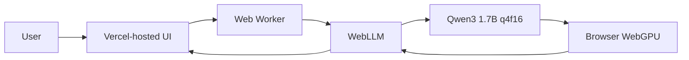

<div align="center">

# 🤖 Rishi AI BOT1

### One AI project. Two private ways to run it.

**Qwen3 1.7B · Local Llamafile · Browser WebGPU · No Cloud Inference API · No API Key**

[](https://rishi-ai-bot1.vercel.app)


</div>

---

## ✨ What is Rishi AI BOT1?

Rishi AI BOT1 is a local-first AI assistant built around **Qwen3 1.7B**.

It now has two execution modes:

1. **Live browser mode** — the website is hosted on Vercel, but Qwen inference runs inside the visitor's browser through **WebLLM + WebGPU**.
2. **Windows offline mode** — a GGUF model runs locally through **Llamafile** in CPU compatibility mode.

The project does not require an OpenAI, Gemini, Anthropic, or other hosted inference API key.

## 🌐 Live demo

### https://rishi-ai-bot1.vercel.app

The live version intentionally does **not** run the model on a Vercel server. Vercel serves the frontend; the model is downloaded to and executed on the visitor's device.

### Browser requirements

- A recent browser with WebGPU support — Chrome or Edge recommended
- Roughly **2 GB of available GPU memory** for the selected WebLLM Qwen3 build
- Internet access for the initial page/model download

The browser can cache model artifacts, making later model starts faster.

## 🚀 Web features

- 🧠 Qwen3 1.7B browser inference
- ⚡ WebGPU acceleration
- 🔒 Prompts stay in the browser during inference
- 🔑 No inference API key
- 💬 Streaming responses
- 🧩 Qwen3 thinking-mode toggle
- ⏹️ Stop generation control
- 💾 Local browser chat history
- 📱 Responsive desktop/mobile UI
- 📊 Model loading progress
- 🧵 Web Worker inference to keep the interface responsive

## 🖥️ Local Windows features

- 📴 Fully local operation after the required files are present
- 📦 Qwen3 1.7B `Q4_K_M` GGUF
- ⚙️ CPU-only compatibility profile
- 🖱️ One-click `start.bat`
- 🌐 Local chat server at `127.0.0.1:8081`
- 🚫 Model/runtime binaries excluded from GitHub

## 🧩 Architecture

### Browser / deployed mode



### Local Windows mode


## 📁 Project structure

```text
Rishi-AI-BOT1/
├── src/
│   ├── main.js             # Web chat + WebLLM integration
│   ├── style.css           # Responsive UI
│   └── worker.js           # WebLLM Web Worker
├── .gitattributes
├── .gitignore
├── CHANGELOG.md
├── index.html              # Vite entry page
├── LICENSE
├── package.json            # Browser build dependencies
├── README.md
├── start.bat               # Windows local launcher
│
├── llamafile-0.10.5.exe    # local only — ignored by Git
└── qwen3-1.7b-q4_k_m.gguf  # local only — ignored by Git
```

## 🌐 Run the web version locally

Requirements: Node.js and npm.

```bash
git clone https://github.com/Rishikeshsanin/Rishi-AI-BOT1.git
cd Rishi-AI-BOT1
npm install
npm run dev
```

Then open the local URL printed by Vite.

For a production build:

```bash
npm run build
```

The output is written to `dist/`.

## 📴 Run the fully local Windows version

### 1. Clone the repository

```bash
git clone https://github.com/Rishikeshsanin/Rishi-AI-BOT1.git
cd Rishi-AI-BOT1
```

### 2. Add the runtime files

Place these beside `start.bat`:

```text
llamafile-0.10.5.exe
qwen3-1.7b-q4_k_m.gguf
```

The large runtime/model files are intentionally not stored in this GitHub repository.

### 3. Launch

Double-click:

```text
start.bat
```

The launcher validates both files and starts:

```text
http://127.0.0.1:8081
```

Keep the terminal open while chatting.

## 🛠️ Local launcher configuration

```text
--server
--model qwen3-1.7b-q4_k_m.gguf
--gpu disable
--host 127.0.0.1
--port 8081
```

### Why CPU mode?

Automatic CUDA initialization failed on the original test system. The included launcher therefore forces CPU mode for predictable compatibility.

### Why port 8081?

The original setup encountered another Windows service occupying port `8080`, so this project defaults to `8081`.

## 🩺 Troubleshooting

### Live site says WebGPU unavailable

Use an up-to-date Chromium-based browser and ensure hardware acceleration/WebGPU is available on the device.

### Browser model fails to load

The browser may not have enough available GPU memory. Close GPU-heavy tabs/apps and retry. Different hardware/browser combinations can expose different WebGPU limits.

### Local mode shows `CUDA error`

Confirm `start.bat` includes:

```text
--gpu disable
```

### Local mode cannot bind the server socket

Check whether port `8081` is occupied:

```cmd
netstat -ano | findstr :8081
```

### Local browser says `Server unavailable`

Wait until the terminal reports:

```text
listening on http://127.0.0.1:8081
```

then refresh the page.

## 🔐 Privacy model

### Web deployment

The website itself is delivered over the internet, and model artifacts are initially downloaded from the model host. **Inference is performed in the user's browser rather than by a Rishi AI BOT1 backend API.**

### Windows deployment

Llamafile binds to the loopback address `127.0.0.1`, keeping the local server intended for access from the same computer.

Do not expose the Llamafile server publicly without adding appropriate authentication and network security controls.

## 🧪 Tech stack

| Component | Purpose |
|---|---|
| **Qwen3 1.7B** | Language model |
| **WebLLM** | Browser-side LLM inference runtime |
| **WebGPU** | Browser hardware acceleration |
| **Web Worker** | Runs inference away from the main UI thread |
| **Vite** | Web build tooling |
| **Vercel** | Static web deployment |
| **GGUF Q4_K_M** | Quantized local model format |
| **Llamafile** | Windows local runtime + HTTP UI |
| **Batch** | One-click local launcher |

## ✅ Project status

- [x] Qwen3 1.7B local GGUF inference
- [x] CPU-only Windows launcher
- [x] Branded browser frontend
- [x] Qwen3 WebLLM integration
- [x] Web Worker inference
- [x] Streaming chat
- [x] Thinking-mode toggle
- [x] Browser chat persistence
- [x] Production Vite build
- [x] Live Vercel deployment
- [ ] Optional local GPU profile
- [ ] PWA/offline frontend shell
- [ ] Model selector
- [ ] Automated tests
- [ ] Demo GIF/video

## 🗺️ Roadmap

- Add installable PWA support
- Add selectable lightweight models
- Add generation controls
- Add export/import chat
- Add performance metrics such as tokens/second
- Add optional local GPU launch profiles
- Add automated browser smoke tests

## 📜 License

The original application code, launcher scripts, and documentation in this repository are released under the MIT License.

Qwen, WebLLM, Llamafile, model weights, and other third-party components remain governed by their respective licenses.

---

<div align="center">

**Built to explore private, local-first AI across desktop and the web.**

[Open the live app](https://rishi-ai-bot1.vercel.app) · [View the source](https://github.com/Rishikeshsanin/Rishi-AI-BOT1)

⭐ If you like the project, consider starring the repository.

</div>
