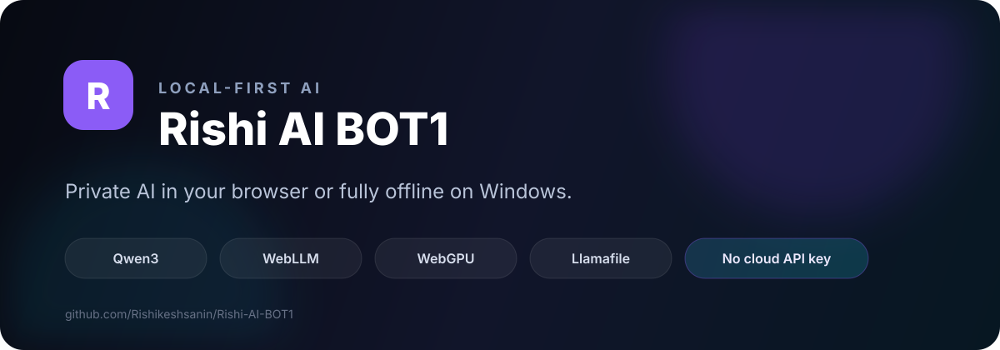
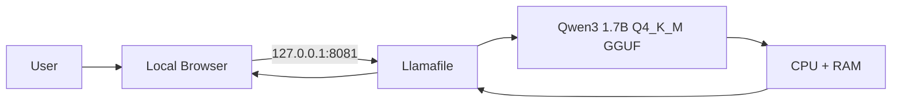
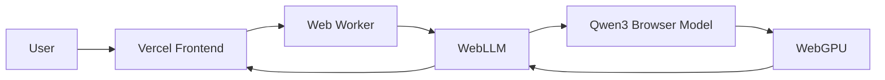

<p align="center">
  
</p>

<p align="center">
  
  
  <a href="https://github.com/Rishikeshsanin/Rishi-AI-BOT1/actions"></a>
  
</p>

<p align="center">
  <strong>Qwen3 1.7B · GGUF · Llamafile · Local Browser UI · CPU Mode</strong><br />
  Your AI assistant for the moments when the internet is unavailable.
</p>

---

# 📴 The idea

**Rishi AI BOT1 is primarily an offline AI assistant.**

The real use case is simple:

> **No mobile signal? No Wi-Fi? No internet connection? You can still open Rishi AI BOT1 on your laptop and chat with an AI model running entirely on your own machine.**

Once the required model and runtime files are already on the computer, the Windows version does not need a cloud inference API, an API key, or an active internet connection to generate responses.

That makes it useful for situations such as:

- ✈️ travelling with unreliable connectivity
- 🚆 trains, buses, flights, remote locations, or weak-signal areas
- 📴 temporary internet outages
- 🎓 studying or experimenting without depending on a cloud AI service
- 🔒 keeping prompts on your own machine
- 🧪 learning how local LLM inference works

## The project in one picture

```text
                 RISHI AI BOT1
                       │
             ┌─────────┴─────────┐
             │                   │
      📴 PRIMARY MODE       🌐 EXPERIMENTAL MODE
      Windows Offline        Browser Demo
             │                   │
       Llamafile             WebLLM / WebGPU
             │                   │
    Qwen3 1.7B GGUF        Qwen3 browser model
             │                   │
       CPU + RAM             Visitor GPU
             │                   │
     NO INTERNET ✅      Hardware-sensitive ⚠️
```

---

# ⭐ Primary mode — fully local Windows AI

This is the **main version of Rishi AI BOT1** and the part of the project I recommend using.

The model runs locally through Llamafile and exposes a browser interface only on your own computer:

```text
You
 │
 ▼
Browser UI
 │
 │ http://127.0.0.1:8081
 ▼
Llamafile
 │
 ▼
Qwen3 1.7B Q4_K_M GGUF
 │
 ▼
CPU + System RAM
```

### What this means

Once setup is complete:

- ✅ no internet is required to chat
- ✅ no cloud inference server is required
- ✅ no OpenAI/Gemini/Anthropic API key is required
- ✅ no per-message API cost
- ✅ prompts and generated responses stay on the machine
- ✅ the interface still works through a normal browser

The browser is only acting as the **local UI**. The AI itself is running on your computer.

---

# ⚡ Offline quick start

## 1. Clone the repository

```bash
git clone https://github.com/Rishikeshsanin/Rishi-AI-BOT1.git
cd Rishi-AI-BOT1
```

## 2. Add the two local runtime files

Place these beside `start.bat`:

```text
llamafile-0.10.5.exe
qwen3-1.7b-q4_k_m.gguf
```

They are intentionally excluded from GitHub because they are large third-party runtime/model files.

Your folder should look like:

```text
Rishi-AI-BOT1/
├── start.bat
├── llamafile-0.10.5.exe
├── qwen3-1.7b-q4_k_m.gguf
└── ...repository files
```

## 3. Launch

Double-click:

```text
start.bat
```

The launcher checks the required files and starts Qwen3 in CPU compatibility mode.

Wait until the terminal shows:

```text
listening on http://127.0.0.1:8081
```

Then open:

```text
http://127.0.0.1:8081
```

You can now disconnect from the internet and continue chatting locally.

---

# 🔌 Why it works without internet

A normal cloud chatbot works roughly like this:

```text
Your device → Internet → Cloud AI server → Internet → Response
```

Rishi AI BOT1 offline mode works like this:

```text
Your device → Your local model → Response
```

The model weights are already stored locally, so inference happens on the laptop itself.

The launcher uses:

```text
--server
--model qwen3-1.7b-q4_k_m.gguf
--gpu disable
--host 127.0.0.1
--port 8081
```

### Why CPU mode?

During development, automatic CUDA initialization caused a GPU backend crash on the original test machine. The project therefore defaults to CPU mode for more predictable compatibility.

### Why port 8081?

Port `8080` was already occupied by another Windows service during setup, so the local server uses `8081` by default.

---

# 🌐 Experimental browser demo

A deployed browser version also exists:

### **https://rishi-ai-bot1.vercel.app**

<p>
  <a href="https://rishi-ai-bot1.vercel.app"></a>
</p>

This version was built as an experiment to see how far we could push **browser-side AI using WebLLM + WebGPU**.

It is **not the primary version of the project**.

The web build can:

- detect WebGPU
- download a browser-compatible Qwen3 model
- run inference on the visitor's GPU
- stream responses
- fall back to a lighter model profile
- keep chat history locally in the browser

However, browser-side inference is heavily dependent on GPU memory, browser support, drivers, and available system resources.

> ⚠️ **Current status:** the online version is experimental and may be slow or fail to initialize on some machines. The offline Windows version is the recommended and more reliable way to use Rishi AI BOT1.

This limitation is also part of what makes the project useful technically: it compares a dependable local desktop inference path against a much more hardware-sensitive browser inference path.

---

# 🧠 Features

### Offline Windows

- 📴 works without internet after setup
- 🧠 Qwen3 1.7B local model
- 📦 Q4_K_M GGUF quantization
- ⚙️ CPU compatibility mode
- 🖱️ one-click `start.bat`
- 🌐 browser-based local UI
- 🔐 loopback-only server on `127.0.0.1`
- 🔑 no hosted inference API key
- 💸 no per-message API billing

### Experimental web demo

- ⚡ WebGPU inference
- 🧵 Web Worker execution
- 💬 streaming responses
- 🧩 thinking-mode toggle
- 🔁 adaptive model fallback
- 💾 browser-local chat history
- ▲ deployed with Vercel

---

# 🏗️ Architecture

## Offline Windows — recommended



## Browser experiment



For more detail, see [`docs/ARCHITECTURE.md`](docs/ARCHITECTURE.md).

---

# 📁 Repository structure

```text
Rishi-AI-BOT1/
├── .github/
│   └── workflows/
│       └── ci.yml
├── assets/
│   └── rishi-ai-banner.svg
├── docs/
│   └── ARCHITECTURE.md
├── src/
│   ├── main.js
│   ├── style.css
│   └── worker.js
├── CHANGELOG.md
├── CONTRIBUTING.md
├── index.html
├── LICENSE
├── package.json
├── README.md
├── SECURITY.md
└── start.bat
```

Local-only files:

```text
llamafile-0.10.5.exe
qwen3-1.7b-q4_k_m.gguf
```

These remain ignored by Git.

---

# 🧪 Tech stack

| Technology | Role |
|---|---|
| **Qwen3 1.7B** | Local language model |
| **GGUF Q4_K_M** | Quantized offline model format |
| **Llamafile** | Local inference runtime + HTTP server |
| **Windows Batch** | One-click local launcher |
| **WebLLM** | Experimental browser-side LLM runtime |
| **WebGPU** | Browser hardware acceleration |
| **Web Worker** | Keeps browser inference off the main UI thread |
| **Vite** | Web frontend build tooling |
| **Vercel** | Experimental browser deployment |
| **GitHub Actions** | Build validation |

---

# 🩺 Troubleshooting

### Offline mode shows `CUDA error`

The project is designed to run in CPU compatibility mode. Confirm the launcher contains:

```text
--gpu disable
```

### `couldn't bind HTTP server socket`

Check whether port `8081` is in use:

```cmd
netstat -ano | findstr :8081
```

Close the conflicting process or change the configured port.

### Browser says `Server unavailable`

The model may still be loading. Wait until the terminal shows:

```text
listening on http://127.0.0.1:8081
```

Then refresh the local browser page.

### Experimental web version is slow

That version performs inference on the visitor's GPU inside the browser. Performance varies substantially between devices. For reliable use, use the offline Windows version instead.

### Experimental web model does not load

Try a recent Chrome/Edge build with hardware acceleration enabled. Even with WebGPU available, some GPU/driver combinations may not have enough resources to initialize the model.

---

# 🔐 Privacy

## Offline mode

This is the strongest privacy mode in the project.

The Llamafile server binds to:

```text
127.0.0.1
```

which is the local loopback interface. The intended setup keeps inference and prompts on the same computer.

## Web demo

The frontend and model files require internet access to download. Once loaded, the project is designed for inference to happen inside the browser rather than through a project-owned AI backend.

Do not expose the local Llamafile server to the public internet without authentication and appropriate network security.

---

# ✅ Project status

- [x] Qwen3 1.7B GGUF local inference
- [x] fully offline chat after setup
- [x] CPU-only compatibility mode
- [x] local browser UI
- [x] one-click Windows launcher
- [x] Git exclusions for large binaries/models
- [x] branded GitHub documentation
- [x] architecture documentation
- [x] GitHub Actions build check
- [x] experimental WebLLM/WebGPU version
- [x] Vercel deployment
- [ ] improve browser inference performance
- [ ] fast/quality model selector
- [ ] automated offline setup helper
- [ ] tokens-per-second metrics
- [ ] packaged release
- [ ] demo GIF/video

---

# 🗺️ Roadmap

The project will continue to prioritize the **offline experience** first.

Planned improvements:

1. easier model/runtime installation
2. auto-open the local browser when the model is ready
3. better CPU performance presets
4. optional GPU profiles for compatible systems
5. portable USB-ready release
6. configurable local models
7. improved browser demo performance
8. export/import chat history

---

# 🤝 Contributing

Contributions are welcome. See [`CONTRIBUTING.md`](CONTRIBUTING.md).

For security guidance, see [`SECURITY.md`](SECURITY.md).

---

# 📜 License

The original code, launcher scripts, and documentation in this repository are released under the **MIT License**.

Qwen, WebLLM, Llamafile, model weights, and other third-party components remain governed by their respective licenses.

---

<p align="center">
  <strong>Rishi AI BOT1</strong><br />
  AI that is still there when the internet isn't.<br /><br />
  <a href="docs/ARCHITECTURE.md">Architecture</a> ·
  <a href="https://rishi-ai-bot1.vercel.app">Experimental Web Demo</a> ·
  <a href="CONTRIBUTING.md">Contributing</a>
</p>
