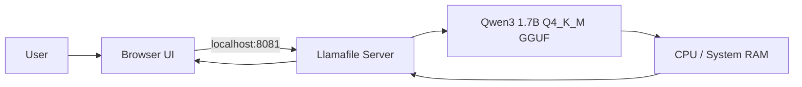

<div align="center">

# 🤖 Rishi AI BOT1

### A private, fully offline AI assistant that runs on your own Windows PC.

**Qwen3 1.7B · GGUF · Llamafile · CPU Mode · No Cloud API · No API Key**


</div>

---

## ✨ What is Rishi AI BOT1?

Rishi AI BOT1 is a lightweight local AI setup that runs a quantized Qwen3 model directly on a Windows computer using Llamafile.

Once the required model and runtime files are downloaded, the assistant can run without an internet connection. The model stays on the device and the chat interface is served locally in the browser.

This repository intentionally **does not store the large model or Llamafile binary**. It contains the launcher, configuration, documentation, and project setup needed to run them locally.

## 🚀 Highlights

- 🔒 **Local-first** — prompts and responses stay on your machine
- 📴 **Offline after setup** — no cloud inference required
- 🔑 **No API keys** — no OpenAI, Gemini, Anthropic, or other hosted API needed
- 🧠 **Qwen3 1.7B** — compact model suitable for local experimentation
- 📦 **GGUF quantization** — uses the `Q4_K_M` model format
- ⚙️ **CPU compatibility mode** — avoids CUDA/GPU compatibility crashes
- 🌐 **Browser chat UI** — accessible at `http://127.0.0.1:8081`
- 🖱️ **One-click Windows launcher** — start with `start.bat`
- 🧳 **Portable design** — the same folder can be moved to another compatible Windows PC

## 🧩 Architecture



Everything runs locally. The web interface talks to Llamafile over the loopback address `127.0.0.1`.

## 📁 Project structure

```text
Rishi-AI-BOT1/
├── .gitattributes
├── .gitignore
├── CHANGELOG.md
├── LICENSE
├── README.md
├── start.bat
│
├── llamafile-0.10.5.exe          # local only — ignored by Git
└── qwen3-1.7b-q4_k_m.gguf        # local only — ignored by Git
```

The two large runtime files are excluded through `.gitignore`, keeping the GitHub repository lightweight.

## ✅ Requirements

- Windows 10 or Windows 11
- 64-bit CPU
- Enough free RAM to load the model and run inference
- A modern browser
- `llamafile-0.10.5.exe`
- `qwen3-1.7b-q4_k_m.gguf`

A dedicated GPU is **not required** for this configuration.

## ⚡ Quick start

### 1. Clone the repository

```bash
git clone https://github.com/Rishikeshsanin/Rishi-AI-BOT1.git
cd Rishi-AI-BOT1
```

### 2. Add the required local files

Place these files in the repository root beside `start.bat`:

```text
llamafile-0.10.5.exe
qwen3-1.7b-q4_k_m.gguf
```

> Download Llamafile from its official project releases and obtain a compatible Qwen3 1.7B `Q4_K_M` GGUF model from a trusted model source. Verify the model's license and checksum when available.

### 3. Launch the assistant

Double-click:

```text
start.bat
```

The launcher checks that both required files exist and then starts the local server in CPU mode.

### 4. Open the chat UI

When the terminal shows that the server is listening, open:

```text
http://127.0.0.1:8081
```

Keep the terminal window open while using the assistant.

## 🛠️ Launcher configuration

The included launcher runs Llamafile with these core options:

```text
--server
--model qwen3-1.7b-q4_k_m.gguf
--gpu disable
--host 127.0.0.1
--port 8081
```

### Why CPU mode?

During development, automatic CUDA initialization caused the runtime to exit with a CUDA backend error on the test machine. Forcing CPU mode provides a more predictable Windows setup and avoids requiring a working CUDA environment.

### Why port 8081?

Port `8081` is used to reduce the chance of colliding with software that commonly occupies port `8080`.

## 🩺 Troubleshooting

### `CUDA error`

Make sure the launcher includes:

```text
--gpu disable
```

The provided `start.bat` already uses CPU mode.

### `couldn't bind HTTP server socket`

Another program is using the configured port. Check it with:

```cmd
netstat -ano | findstr :8081
```

Either close the conflicting program or change `PORT` inside `start.bat`.

### Browser says `Server unavailable`

The model may still be loading. Wait until the terminal reports:

```text
listening on http://127.0.0.1:8081
```

Then refresh the browser.

### `Missing Llamafile runtime`

Confirm that this exact file is beside `start.bat`:

```text
llamafile-0.10.5.exe
```

### `Missing Qwen model`

Confirm that this exact file is beside `start.bat`:

```text
qwen3-1.7b-q4_k_m.gguf
```

## 🔐 Privacy & security

The launcher binds the server to `127.0.0.1`, so the interface is intended to be reachable only from the same computer.

The Llamafile web UI may display a CORS/API-key warning. This project is designed for local loopback use; do not change the host to a public or LAN-facing address unless you understand the security implications and configure appropriate authentication/network controls.

## 📊 Current project status

- [x] Qwen3 1.7B GGUF loads successfully
- [x] CPU-only inference works
- [x] Local web UI works
- [x] One-click Windows launcher
- [x] Large binaries excluded from Git
- [x] Troubleshooting documentation
- [ ] Optional GPU acceleration profile
- [ ] Automated model/runtime setup helper
- [ ] Clean demo screenshots / GIF
- [ ] Configurable model profiles

## 🗺️ Roadmap

Future improvements may include:

- Auto-open the browser after the server becomes ready
- Optional NVIDIA/AMD acceleration profiles
- Model selection from the launcher
- Configurable context size and inference settings
- Portable setup assistant
- Cleaner branded frontend
- Packaged release instructions

## 🧪 Built with

| Component | Purpose |
|---|---|
| **Qwen3 1.7B** | Local language model |
| **GGUF Q4_K_M** | Quantized model format |
| **Llamafile** | Local model runtime + HTTP server |
| **Windows Batch** | One-click launcher |
| **Browser UI** | Local chat interface |

## 🤝 Contributing

Issues, suggestions, and improvements are welcome. If you make a change, keep the repository lightweight and do not commit model files or large runtime binaries.

## 📜 License

The original scripts and documentation in this repository are released under the MIT License. Third-party software and model files are governed by their own licenses and are not included in this repository.

---

<div align="center">

**Built as an experiment in private, local-first AI.**

⭐ If you find the project useful, consider starring the repository.

</div>
