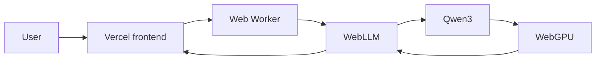
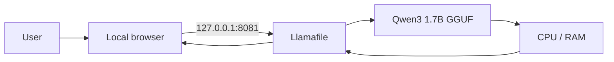

<p align="center">
  
</p>

<p align="center">
  <a href="https://rishi-ai-bot1.vercel.app"></a>
  <a href="https://github.com/Rishikeshsanin/Rishi-AI-BOT1/actions"></a>
  
</p>

<p align="center">
  <strong>Qwen3 · WebLLM · WebGPU · Llamafile · Vite · Vercel</strong><br />
  One project, two local-first ways to run AI.
</p>

---

## Overview

**Rishi AI BOT1** is a local-first AI assistant built to explore private on-device inference without depending on a paid cloud inference API.

It supports two modes:

| Mode | Runtime | Model | Best for |
|---|---|---|---|
| **Web demo** | WebLLM + WebGPU | Qwen3 1.7B with lighter fallback | Easy portfolio/demo access |
| **Windows offline** | Llamafile + CPU | Qwen3 1.7B `Q4_K_M` GGUF | Reliable fully local use |

> **Note:** the browser version is experimental and hardware-sensitive. It can be slower or fail to initialize on some GPUs/drivers. The Windows Llamafile mode is the more predictable local option.

## Live demo

### **https://rishi-ai-bot1.vercel.app**

Vercel hosts the frontend, while the browser version is designed to run inference on the visitor's device through WebGPU rather than through a Rishi AI backend inference API.

The browser build:

- checks WebGPU support
- attempts the preferred Qwen3 profile
- falls back to a lighter Qwen3 profile when required
- streams generated text
- supports a thinking-mode toggle
- keeps chat history in browser storage
- requires no hosted inference API key

### Browser requirements

- Recent Chrome/Edge or another browser with working WebGPU support
- Hardware acceleration enabled
- Sufficient available GPU memory
- Internet access for the initial site/model download

Model artifacts may be cached by the browser after the first load.

## Windows offline mode

The local version runs a quantized Qwen3 GGUF model through Llamafile and is configured for CPU compatibility.

```text
Browser
   │
   │ 127.0.0.1:8081
   ▼
Llamafile
   │
   ▼
Qwen3 1.7B Q4_K_M
   │
   ▼
CPU + system RAM
```

### Quick start

```bash
git clone https://github.com/Rishikeshsanin/Rishi-AI-BOT1.git
cd Rishi-AI-BOT1
```

Place these two local-only files beside `start.bat`:

```text
llamafile-0.10.5.exe
qwen3-1.7b-q4_k_m.gguf
```

Then double-click:

```text
start.bat
```

When the terminal reports that the server is listening, open:

```text
http://127.0.0.1:8081
```

The launcher intentionally uses:

```text
--gpu disable
--host 127.0.0.1
--port 8081
```

CPU mode avoids the CUDA initialization problem encountered during development, and port `8081` avoids a local service conflict previously observed on `8080`.

## Web development

```bash
npm install
npm run dev
```

Production build:

```bash
npm run build
```

The `main` branch is connected to Vercel for deployment, and GitHub Actions validates that the web build still succeeds.

## Architecture

### Browser mode



### Windows mode



For more detail, see [`docs/ARCHITECTURE.md`](docs/ARCHITECTURE.md).

## Project structure

```text
Rishi-AI-BOT1/
├── .github/
│   └── workflows/
│       └── ci.yml
├── assets/
│   └── rishi-ai-banner.svg
├── docs/
│   └── ARCHITECTURE.md
├── src/
│   ├── main.js
│   ├── style.css
│   └── worker.js
├── CHANGELOG.md
├── CONTRIBUTING.md
├── index.html
├── LICENSE
├── package.json
├── README.md
├── SECURITY.md
└── start.bat
```

The following large files stay local and are ignored by Git:

```text
llamafile-0.10.5.exe
qwen3-1.7b-q4_k_m.gguf
```

## Highlights

- 🔒 Local-first inference design
- 🧠 Qwen3-powered chat
- ⚡ WebGPU browser acceleration
- 🧵 Web Worker inference
- 🔁 Adaptive browser model fallback
- 💬 Streaming responses
- 🧩 Thinking-mode toggle
- 💾 Browser-local chat history
- 📴 Fully local Windows mode
- 🖱️ One-click Windows launcher
- 🚫 No paid inference API required
- ✅ GitHub Actions build validation
- ▲ Vercel deployment

## Troubleshooting

**Browser model is slow**  
Browser inference uses the visitor's own hardware. Close GPU-heavy apps/tabs or use the lighter fallback profile. The desktop Llamafile version may be a better fit for consistent use.

**Browser model fails to load**  
Use a current Chromium-based browser, confirm hardware acceleration is enabled, and check the exact error shown by the app. WebGPU availability alone does not guarantee that every model profile can initialize on every GPU.

**Local mode shows a CUDA error**  
Use the included CPU-only launcher and confirm `--gpu disable` is present.

**Local server cannot bind the port**

```cmd
netstat -ano | findstr :8081
```

Close the conflicting process or change the local port.

## Privacy model

**Web mode:** the site and model artifacts are downloaded over the internet, but chat inference is intended to run in the browser rather than through a project-owned inference backend.

**Windows mode:** Llamafile binds to `127.0.0.1`, keeping the server intended for same-device access.

Do not expose the Llamafile server publicly without authentication and proper network security controls.

## Roadmap

- [x] Local Qwen3 GGUF inference
- [x] CPU-only Windows launcher
- [x] Branded browser frontend
- [x] WebLLM + WebGPU integration
- [x] Adaptive browser fallback
- [x] Streaming chat
- [x] Browser chat persistence
- [x] Vercel deployment
- [x] GitHub Actions build check
- [ ] Fast/Quality model selector
- [ ] PWA/offline frontend shell
- [ ] Tokens-per-second metrics
- [ ] Chat export/import
- [ ] Automated browser smoke tests
- [ ] Demo GIF/video

## Contributing & security

Contributions are welcome — see [`CONTRIBUTING.md`](CONTRIBUTING.md).

For security guidance, see [`SECURITY.md`](SECURITY.md).

## License

The original application code, launcher scripts, and documentation in this repository are released under the **MIT License**.

Qwen, WebLLM, Llamafile, model weights, and other third-party components remain governed by their respective licenses.

---

<p align="center">
  <strong>Built to explore private, local-first AI across the browser and desktop.</strong><br /><br />
  <a href="https://rishi-ai-bot1.vercel.app">Live App</a> ·
  <a href="docs/ARCHITECTURE.md">Architecture</a> ·
  <a href="CONTRIBUTING.md">Contributing</a>
</p>
