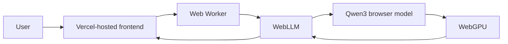
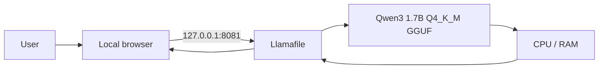

# Architecture

Rishi AI BOT1 deliberately separates **hosting** from **inference**.

## Browser mode

The website code is delivered by Vercel. Model inference is intended to happen on the visitor's device rather than on a Rishi AI backend inference API.

The browser build currently prefers a Qwen3 1.7B WebLLM profile and can fall back to a lighter Qwen3 0.6B profile when needed. Browser performance depends on WebGPU support, driver behavior, available GPU memory, and model initialization limits.

## Windows offline mode

The supplied `start.bat` launches Llamafile in CPU compatibility mode with the server restricted to loopback.

## Design goals

1. Keep inference local whenever possible.
2. Avoid requiring paid inference API keys.
3. Keep the Git repository lightweight by excluding model/runtime binaries.
4. Make the browser demo easy to open while retaining a fully local Windows path.
5. Prefer graceful fallback and clear diagnostics over silent failure.

## Trade-offs

The browser mode is convenient but hardware-sensitive and may be slower on some devices. The Windows mode is more predictable on compatible PCs but requires users to download the model and runtime themselves.
