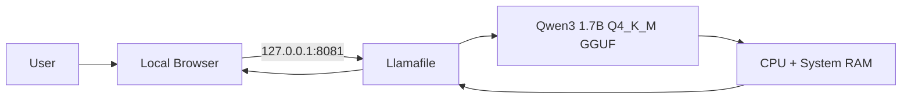

# Architecture

Rishi AI BOT1 is an **offline-first AI project**.

The primary architecture is the Windows local stack: the model, inference runtime, server, prompts, and responses stay on the user's own machine. A browser-only WebGPU build is included as a secondary experiment.

## Primary architecture — Windows offline mode



### Offline data path

```text
Prompt
  ↓
Local browser UI
  ↓
127.0.0.1:8081
  ↓
Llamafile
  ↓
Qwen3 GGUF on local disk
  ↓
CPU / RAM inference
  ↓
Response
```

There is no cloud inference hop in this path. Once the required model and Llamafile runtime are already stored on the computer, active internet access is not required for normal chat generation.

The supplied `start.bat` launches Llamafile with CPU compatibility mode and restricts the server to the loopback interface.

Core launcher settings:

```text
--gpu disable
--host 127.0.0.1
--port 8081
```

## Why offline-first?

The project is intended for situations where connectivity is unreliable or unavailable:

- weak or missing mobile signal
- Wi-Fi outages
- flights, trains, remote locations, travel
- local experimentation without a cloud AI API
- privacy-sensitive prompts that should remain on-device

The goal is not to replace large hosted models. The goal is to provide a useful, compact AI assistant that remains available when the network is not.

## Secondary architecture — experimental browser mode


Vercel serves the website code. The browser build is designed to perform inference on the visitor's device through WebGPU rather than through a project-owned inference API.

The browser build can attempt a larger Qwen3 profile and fall back to a lighter profile. It is intentionally treated as an experiment because performance and initialization depend heavily on:

- WebGPU implementation
- GPU/driver compatibility
- available GPU memory
- browser version
- current system load

This mode is useful as a public demo of client-side LLM inference, but it is not the recommended production path for this project.

## Architecture priorities

1. **Offline availability first** — the primary assistant must remain usable without internet after setup.
2. **Local inference** — prompts should not require a hosted inference API.
3. **Simple startup** — one launcher should bring up the local model server.
4. **Predictable compatibility** — CPU mode is preferred over fragile automatic GPU selection.
5. **Local-only networking** — the default server binds to `127.0.0.1`.
6. **Lightweight Git repository** — large third-party models and runtimes stay outside Git.
7. **Transparent limitations** — the experimental browser mode is documented as hardware-sensitive rather than presented as equivalent to the offline mode.

## Trade-offs

### Windows offline mode

**Strengths**
- works without active internet after setup
- predictable local data path
- no per-message cloud inference cost
- no hosted inference API key
- works even when WebGPU is unavailable

**Trade-offs**
- model/runtime must be downloaded beforehand
- inference speed depends on the local CPU
- a 1.7B model is less capable than large hosted models

### Browser mode

**Strengths**
- easy to open from a URL
- demonstrates WebGPU/WebLLM inference
- no project-owned inference server

**Trade-offs**
- slower or unavailable on some devices
- first load requires internet and a model download
- GPU memory/driver/browser constraints can prevent initialization

## Security boundary

The default Llamafile server uses the loopback interface:

```text
127.0.0.1
```

This is deliberate. The local server is intended for same-device use only. Do not change the host to a public or LAN-facing address without adding appropriate authentication and network controls.
